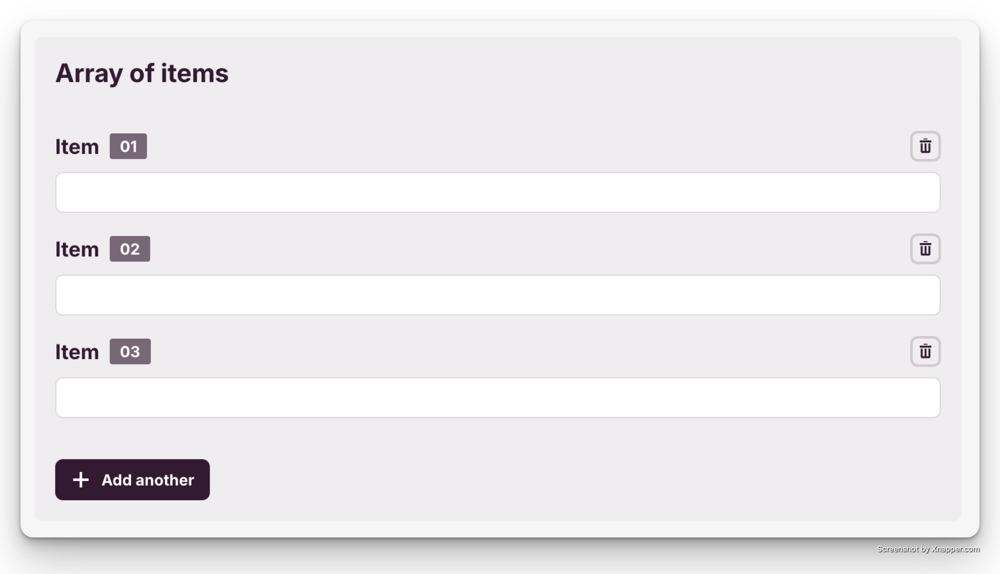
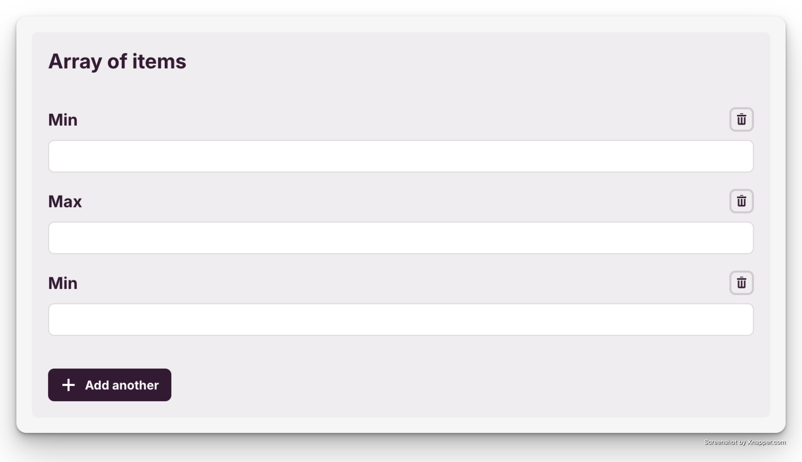
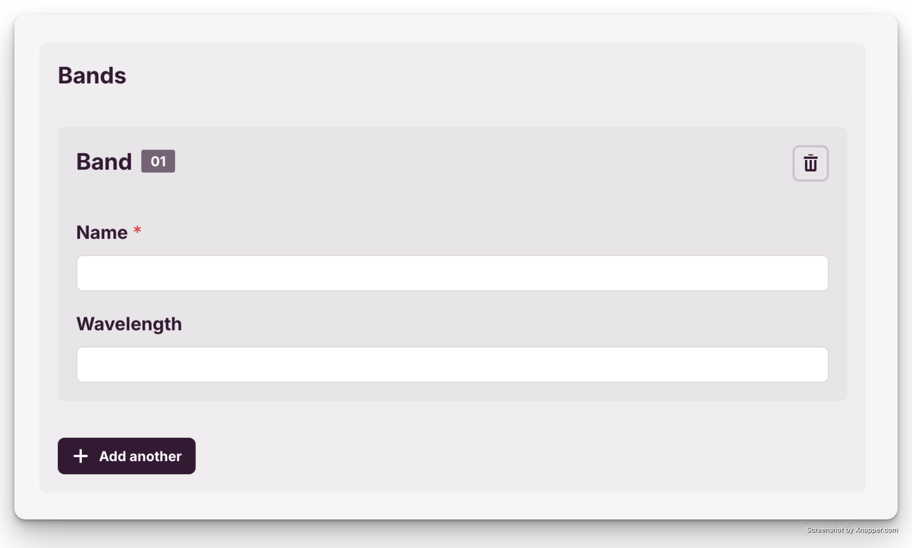
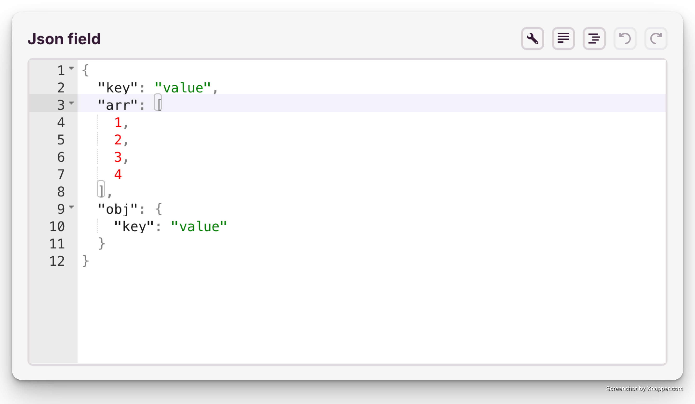

# STAC-Manager 📡 📄 — PLUGINS

- [STAC-Manager 📡 📄 — PLUGINS](#stac-manager----plugins)
  - [Plugin editing schema](#plugin-editing-schema)
    - [String field](#string-field)
    - [Number field](#number-field)
    - [Options field](#options-field)
    - [Array field](#array-field)
      - [Array of strings](#array-of-strings)
      - [Array of options](#array-of-options)
      - [Array of objects](#array-of-objects)
    - [Object field](#object-field)
      - [Restrictions](#restrictions)
    - [Json field](#json-field)


Each plugin should be created handle a specific part of the data.  
Avoid creating a single plugin to handle all the data, as this will make the code harder to maintain and understand.

The app will render a default widget for each field type, but this can be changed by adding a `ui:widget` property to the field.

```ts
import { Plugin, SchemaFieldObject } from '@stac-manager/data-core';

export class PluginName extends Plugin {
  name = 'Plugin Name';

  async init(data) {
    // Once the data to edit is ready the init method of the plugin is called.
    // This method should perform any necessary setup to get data needed to
    // build the edit schema, like for example options for a select field.
  }

  editSchema() {
    // Return the schema for the data to edit in a JSON Schema-like format.
    // From this schema a form will be created.

    // If the plugin is to remain hidden from the user return Plugin.HIDDEN
  }

  enterData(data = {}) {
    // The structure of the original data and the structure of the form data
    // may not match.
    // This method receives the original data and should return the data in the
    // format the form needs.
    // The format of the form data will very much depend on the returned schema.
  }

  exitData(data) {
    // The data entered in the form may not match the structure of the original
    // data.
    // This method receives the data entered in the form and should return the
    // data in the format of the original data, ready to send to the server.
  }
}
```

After the plugin is created it should be added to the plugin configuration. See [README](./README.md) for the config details.

## Plugin editing schema

Each plugin should start with an object of type `root`. Each property of this object is a field of the schema.

```js
{
  type: 'root',
  required: [],
  properties: {
    // Fields
  }
}
```
The `required` array defines the properties of `root` that are required.

### String field

Text fields should be of type `string`:

```js
{
  type: 'root',
  properties: {
    title: {
      label: 'Title',
      type: 'string'
    }
  }
}
```


### Number field

Number fields should be of type `number`:

```js
{
  type: 'root',
  properties: {
    amount: {
      label: 'Amount',
      type: 'number'
    }
  }
}
```

### Options field

A field of type `string` with an `enum` property will be rendered as radio buttons.  
This means that the final result is a single string, but from a restricted list.


The `enum` options are defined as an array of tuples, where the first element is the value to send to the server and the second is the label to show in the form.

```js
{
  type: 'root',
  properties: {
    colormap: {
      label: 'Colormap Name',
      type: 'string',
      enum: [
        ['viridis', 'Viridis'],
        ['plasma', 'Plasma'],
        ['inferno', 'Inferno']
      ]
    }
  }
}
```

Using `'ui:widget': 'select'` maintains the same functionality but renders a select field.


Using `'ui:widget': 'tagger'` allows the user to select an option from the list or add a new one:


### Array field

Array fields are used when the user needs to enter multiple values for a single field and are defined with the `array` type and an `items` object

```js
{
  type: 'root',
  properties: {
    temporal: {
      label: 'Temporal Extent',
      type: 'array',
      minItems: 1, // Optional - default is 0
      maxItems: 3, // Optional - default is unlimited
      items: {
        // Structure of the items in the array
      }
    }
  }
}
```
The `array` field renders a widget that allows the user to add and remove items from the list. Depending on the `minItems` and `maxItems` properties, the actions to add and remove items will be enabled or disabled.


#### Array of strings

Used to enter a list of strings, which by default will be rendered as a list of text fields.

```js
{
  type: 'root',
  properties: {
    temporal: {
      label: 'Temporal Extent',
      type: 'array',
      items: {
        label: 'Item'
        type: 'string'
      }
    }
  }
}
```

With the default widget, the `label` property of the `items` object is used as the label for each text field.  
If the `label` is a simple `string` it will have the field number appended to it.  
If the `label` is an `array` of strings, each string will be used as a label for each field cycling through the array if necessary.

| Label String | Label array |
|----------|----------|
| `'Item'`  | `['Min', 'Max']`  |
|  |    |

You can also use the `'ui:widget': 'tagger'` to allow the user to input multiple strings. In this case the `label` value is ignored.


#### Array of options

If we add an `enum` property to the items of an array, the array will be rendered as a list of checkboxes. The final result will be an array of strings from a restricted list.


The `enum` options are defined as an array of tuples, where the first element is the value to send to the server and the second is the label to show in the form.

```js
{
  type: 'root',
  properties: {
    provider: {
      label: 'Providers',
      type: 'array',
      items: {
        type: 'string',
        enum: [
          ['nasa', 'NASA'],
          ['esa', 'ESA'],
          ['jaxa', 'JAXA']
        ]
      }
    }
  }
}
```

Changing the `'ui:widget': 'select'` it will render a multiselect field.


Using `'ui:widget': 'tagger'` allows the user to select multiple options from the list or add new ones:


#### Array of objects

The most complex option is when an array of objects is needed. This is done by defining the `items` property as an object with its own properties.

The `properties` of the `items` object can then be defined as any other field.

```js
{
  type: 'root',
  properties: {
    bands: {
      label: 'Bands',
      type: 'array',
      items: {
        type: 'object',
        label: 'Band',
        required: ['name'],
        properties: {
          name: {
            label: 'Name',
            type: 'string'
          },
          wavelength: {
            label: 'Wavelength',
            type: 'number'
          }
        }
      }
    }
  }
}
```
The `required` array defines the properties of `object` that are required.



### Object field

The `object` field allows the definition of subfields under the `properties` key, and it's meant to be used with an `array` parent. (See [restrictions](#restrictions) below.)

```ts
{
  type: 'object',
  required: ['name'],
  properties: {
    name: {
      label: 'Name',
      type: 'string'
    },
    nick: {
      label: 'Nickname',
      type: 'string'
    }
  },
  additionalProperties: true
}
```
The `required` array defines the properties that are required using their key.

The `additionalProperties` enabled the user to add new arbitrary properties to the object, by defining a key, selecting a type and providing a value. **This should be considered only for advanced use cases.**.


#### Restrictions

An object field should only be used as a child of an array field.  
Defining and object as the type of another object's properties will result in a strange user experience.

Whenever the original data has this type of structure, consider transforming the data to a more user-friendly format using the `enterData` and `exitData` methods.

Example:
```ts
{
  extent: {
    spatial: {
      bbox: [0, 0, 1, 1]
    }
  }
}
```

Instead of doing an object field with another object as child:
```ts
// ❌ Don't do this
{
  type: 'root',
  properties: {
    extent: {
      label: 'Extent',
      type: 'object',
      properties: {
        spatial: {
          label: 'Spatial',
          type: 'object',
          properties: {
            bbox: {
              label: 'Bounding Box',
              type: 'array',
              items: {
                type: 'number'
              }
            }
          }
        }
      }
    }
  }
}
```
Use the enter and exit data methods to transform the data resulting in a more user-friendly form:
```ts
class PluginFriendlyObject extends Plugin {
  editSchema() {
    return {
      type: 'root',
      properties: {
        spatial: {
          label: 'Spatial Extent',
          type: 'array',
          items: {
            type: 'number'
          }
        }
      }
    }
  }

  enterData(data = {}) {
    return {
      spatial: data?.extent?.spatial.bbox || [],
    }
  }

  exitData(data) {
    return {
      extent: {
        spatial: {
          bbox: data.spatial
        }
      }
    }
  }
}
```

### Json field

The `json` field is an escape-hatch that allows the user to input any JSON data. Its usage should be reserved for edge-cases when the data structure is too complex to be represented in a form as it defeats the purpose of the plugin system.

```ts
{
  type: 'root',
  properties: {
    metadata: {
      label: 'Metadata',
      type: 'json'
    }
  }
}
```


